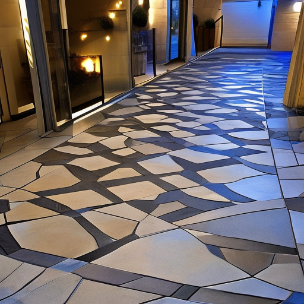
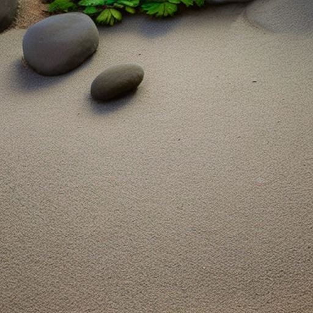
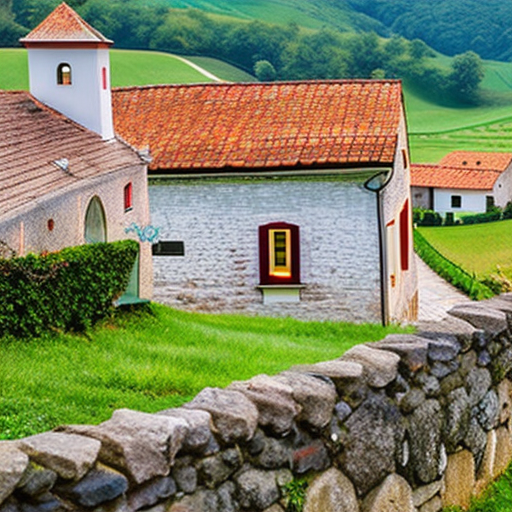
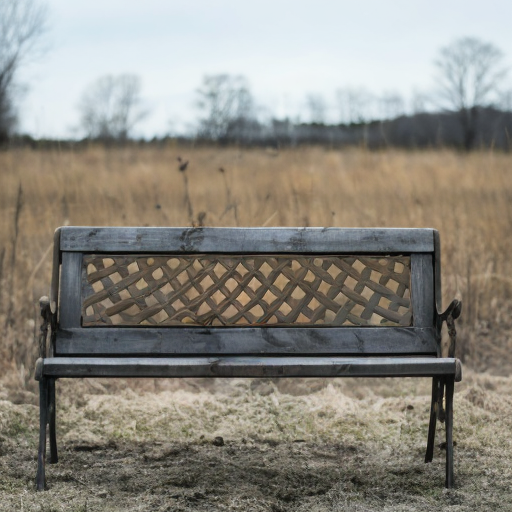
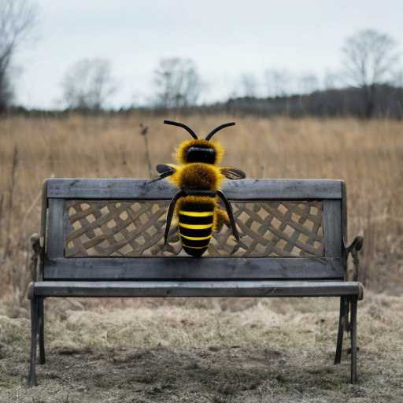
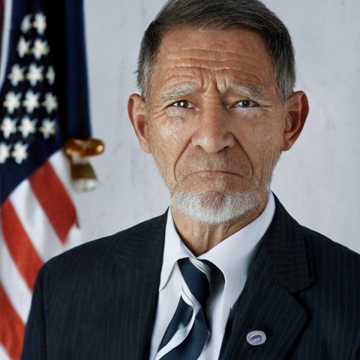

# Open Dream AI

Open Dream AI is a deep learning-based image generation platform that uses StableDiffusion to generate high-quality
images from text prompts. This repository contains the source code for the Open Dream AI platform.

## Table of Contents

- [Installation](#installation)
- [Usage](#usage)
- [Contributing](#contributing)
- [License](#license)

## Installation

To install the Open Dream AI platform, follow these steps:

1. Clone this repository to your local machine.
2. Install the required dependencies by running `pip install -r requirements.txt`.
3. Configure the platform by editing the `app/core/config.py` file. The configuration file contains settings for the
   device to use (CPU or GPU), the project name, the server name, and the output folder to use for storing generated
   images.
4. Start the API server by running `uvicorn app.main:app --reload`. This will start the API server on port 8000.

## Run using Docker

### CPU

1. Clone this repository to your local machine.
2. (Optional) Configure the platform by creating a .env from .env.sample. The configuration file contains settings for
   the device to use (`DEVICE` should be set to cpu, `MIXED_PRECISION` should be set to empty value).
3. Build and start the service using `docker compose -f docker-compose-cpu.yml up`

### CUDA (nvidia)

Requirements

1. Nvidia GPU with [NVIDIA driver](https://docs.nvidia.com/datacenter/tesla/tesla-installation-notes/index.html)
   installed.
2. Install docker on your system.

For instructions on getting started with the NVIDIA Container Toolkit, refer to
the [installation guide](https://docs.nvidia.com/datacenter/cloud-native/container-toolkit/install-guide.html#docker).

Docker-compose:

1. Clone this repository to your local machine.
2. Configure the platform by creating a .env from .env.sample. The configuration file contains settings for the
   device to use (`DEVICE` should be set to cuda).
3. Build and start the service using `docker compose -f docker-compose-cuda.yml up`

OR use native Docker commands:

1. Clone this repository to your local machine.
2. Configure the platform by creating a .env from .env.sample. The configuration file contains settings for the
   device to use (CPU or GPU), the project name, the server name, and the output folder to use for storing generated
   images. (`DEVICE` should be set to cuda).
3. Build the cuda docker image via `docker build -t open-dream-ai-cuda -f ./Dockerfile.cuda .`.
4. Start the Docker image by running `docker run --gpus all -p 8000:80 open-dream-ai-cuda`. This will start the API server on port 8000.

## Usage

Swagger can be found at `http://127.0.0.1:8000/docs/open-dream-ai`

REST API documentation can be found at `http://127.0.0.1:8000/redoc/open-dream-ai`

### Text to Image

<div style="display: flex; flex-direction: column; align-items: center">
  <div style="display: flex;">
    
    
  </div>
  <div style="display: flex; margin-top: -10px;">
    
    
  </div>
</div>

To generate images from text prompts using the Open Dream AI platform, follow these steps:

1. Send a POST request to the `v1/open-dream-ai/txt2img/` endpoint with a JSON payload containing the text prompt and
   other configuration options.
2. The API will generate one or more images from the text prompt using the StableDiffusion pipeline.
3. The API will return a JSON response containing the filenames of the generated images.

For example, to generate a single image from the prompt "Beautiful floor paving", you could use the following `curl`
command:

```curl
curl -X 'POST' \
  'http://127.0.0.1:8000/v1/open-dream-ai/txt2img/' \
  -H 'accept: application/json' \
  -H 'Content-Type: application/json' \
  -d '{
  "prompt": [
    "Beautiful floor paving"
  ]
}'
```

This will generate an image and return a response like the following:

```json
{
  "images": [
    "01FEH7W9N9MH84QJN65F2C8Y26.png"
  ],
  "info": "Your request was placed in background. It will be available shortly."
}
```

The generation will take some time and will run in the background. You can check progress and retrieve generated images
using this filename at the [Get Image](#get-image) endpoint.

### Image to Image

<div style="display: flex; flex-direction: column; align-items: center">
  <div style="display: flex;">
  
  
  </div>
</div>

To generate images from an image using the Open Dream AI platform, follow these steps:

1. Send a POST request to the `v1/open-dream-ai/img2img/` endpoint with a JSON payload containing path to the image, the
   text prompt, and other configuration options.
2. The API will generate one or more images from the image using the StableDiffusion pipeline.
3. The API will return a JSON response containing the filenames of the generated images.

For example, to generate a single image using existing image.jpg and the prompt "Dog sitting on a bench in winter",
you could use the following `curl` command:

```curl
curl -X 'POST' \
  'http://127.0.0.1:8000/v1/open-dream-ai/img2img/' \
  -H 'accept: application/json' \
  -H 'Content-Type: multipart/form-data' \
  -F 'image=@doc_images/dog_on_a_bench.png;type=image/png' \
  -F 'prompt=Dog sitting on a bench in winter' \
  -F 'number_of_images=1' \
  -F 'steps=100' \
  -F 'guidance_scale=7.5' \
  -F 'strength=0.7'
```

This will generate an image and return a response like the following:

```json
{
  "images": [
    "01FEH7W9N9MH84QJN65F2C8Y26.png"
  ],
  "info": "Your request was placed in background. It will be available shortly."
}
```

The generation will take some time and will run in the background. You can check progress and retrieve generated images
using this filename at the [Get Image](#get-image) endpoint.

### Inpaint

<div style="display: flex; flex-direction: column; align-items: center">
  <div style="display: flex;">
    
    
  </div>
  <div style="display: flex; margin-top: -10px;">
    
    
  </div>
</div>

To inpaint image using the Open Dream AI platform, follow these steps:

1. Send a POST request to the `v1/open-dream-ai/inpaint/` endpoint with a JSON payload containing path to the image,
   path to mask image, the text prompt, and other configuration options.
2. The API will generate one or more images from the image using the StableDiffusion pipeline.
3. The API will return a JSON response containing the filenames of the generated images.

For example, to remove a dog from a bench in a photo, send the photo of a dog, the mask to specify what area of the
image should be changed, and enter prompt "An empty bench". You could use the following `curl` command:

```curl
curl -X 'POST' \
  'http://127.0.0.1:8000/v1/open-dream-ai/inpaint/' \
  -H 'accept: application/json' \
  -H 'Content-Type: multipart/form-data' \
  -F 'image=@doc_images/dog_on_a_bench.png;type=image/png' \
  -F 'mask_image=@doc_images/inpaint_mask.png;type=image/png' \
  -F 'prompt=An empty bench' \
  -F 'number_of_images=1' \
  -F 'steps=100' \
  -F 'guidance_scale=7.5'
```

This will generate an image and return a response like the following:

```json
{
  "images": [
    "01FEH7W9N9MH84QJN65F2C8Y26.png"
  ],
  "info": "Your request was placed in background. It will be available shortly."
}
```

The generation will take some time and will run in the background. You can check progress and retrieve generated images
using this filename at the [Get Image](#get-image) endpoint.

### Depth to Image

<div style="display: flex; flex-direction: column; align-items: center">
  <div style="display: flex;">
  
  
  </div>
</div>

To generate image from image with the depth info using Open Dream AI platform, follow these steps:

1. Send a POST request to the `v1/open-dream-ai/depth2img/` endpoint with a JSON payload containing path to the image,
   the text prompt, and other configuration options.
2. The API will generate one or more images from the image using the StableDiffusion pipeline.
3. The API will return a JSON response containing the filenames of the generated images.

For example, to generate a single image using existing image.jpg and the prompt "Old man",
you could use the following `curl` command:

```curl
curl -X 'POST' \
  'http://127.0.0.1:8000/v1/open-dream-ai/depth2img/' \
  -H 'accept: application/json' \
  -H 'Content-Type: multipart/form-data' \
  -F 'image=@doc_images/barack_obama.jpg;type=image/jpeg' \
  -F 'prompt=Old man' \
  -F 'number_of_images=1' \
  -F 'steps=100' \
  -F 'guidance_scale=7.5' \
  -F 'strength=0.7'
```

This will generate an image and return a response like the following:

```json
{
  "images": [
    "01FEH7W9N9MH84QJN65F2C8Y26.png"
  ],
  "info": "Your request was placed in background. It will be available shortly."
}
```

The generation will take some time and will run in the background. You can check progress and retrieve generated images
using this filename at the [Get Image](#get-image) endpoint.

### Get Image

To get generated image by filename, send a GET request to the `v1/open-dream-ai/image/` endpoint with the
filename parameter containing image filename that you got from other endpoints.

For example:

```curl
curl -X 'GET' \
  'http://127.0.0.1:8000/v1/open-dream-ai/image?filename=YOUR-FILENAME.png' \
  -H 'accept: application/json'
```

If the generation process is not yet finished, you will receive a response that looks like this:

```json
{
  "filename": "01FEH7W9N9MH84QJN65F2C8Y26.png",
  "progress": "44%"
}
```

### LoRA fine-tuning

To fine-tune a model using LoRA, send a POST request to the `v1/open-dream-ai/lora` endpoint with
JSON data that contains fine-tuning arguments.

For example:

```curl
curl --location 'http://127.0.0.1:8000/v1/open-dream-ai/lora/' \
--header 'Content-Type: application/json' \
--data '{
    "pretrained_model_name_or_path": "CompVis/stable-diffusion-v1-4",
    "dataset_name": "lambdalabs/pokemon-blip-captions",
    "resolution": 512,
    "random_flip": true,
    "train_batch_size": 1,
    "num_train_epochs": 100,
    "checkpointing_steps": 1000,
    "learning_rate": 0.0001,
    "lr_scheduler": "constant",
    "lr_warmup_steps": 0,
    "seed": 42
}'
```

Response is the process name like following:

```
"2F01GX6WTWSVZ9SZX2CXAQFE7DCA"
```

You can use this process name to monitor fine-tuning progress using [Get progress](#get-lora-progress) endpoint
Once the process is finished, you can use generated LoRA weights using the same process ID as
the "lora_weights" parameter on image generation endpoints.

If the generation is finished and the image is ready, it will be returned as a response instead.

### Get LoRA Progress

To get generated image by filename, send a GET request to the `v1/open-dream-ai/lora/progress` endpoint with the
process_name parameter containing process name that you got from [LoRA fine-tuning](#lora-fine-tuning) endpoint.

For example:

```curl
curl -X 'GET' \
  'http://127.0.0.1:8000/v1/open-dream-ai/lora/progress?process_name=YOUR-PROCESS-NAME' \
  -H 'accept: application/json'
```

If the generation process is not yet finished, you will receive a response that looks like this:

```json
{
  "process_name": "01FEH7W9N9MH84QJN65F2C8Y26",
  "progress": "34%"
}
```

### List Images

To get list of all generated images, send a GET request to the `v1/open-dream-ai/image/list` endpoint.

For example:

```curl
curl -X 'GET' \
  'http://127.0.0.1:8000/v1/open-dream-ai/image/list' \
  -H 'accept: application/json'
```

Response:

```json
[
  "01GYFAY3JWS2446491KG2DKZC8.png",
  "01GYFAZFN2QTGV5XJK752Z3Q3A.png",
  "01GYFC1APG5JQ50H0HSX9FZPEG.png",
  "01GYFC1APGEQ7ECKDG2HGBCJN8.png",
  "01GYFVDMV34E55DZEXQFPDDVQ7.png",
  "01GYFXA7XQQ0W2A037HZ9PZJHS.png",
  "01GYFXFB8GCB5FZHA0H1KABPV9.png"
]
```

### List LoRA models

To get list of all fine-tuned LoRA weights, send a GET request to the `v1/open-dream-ai/lora/lora_models` endpoint.

For example:

```curl
curl -X 'GET' \
  'http://127.0.0.1:8000/v1/open-dream-ai/lora/lora_models \
  -H 'accept: application/json'
```

Response:

```json
[
  "01GYFAY3JWS2446491KG2DKZC8",
  "01GYFAZFN2QTGV5XJK752Z3Q3A",
  "01GYFC1APG5JQ50H0HSX9FZPEG"
]
```

## Contributing

We welcome contributions to the Open Dream AI platform! To contribute, follow these steps:

1. Fork this repository to your own account.
2. Create a new feature branch for your changes.
3. Make your changes and commit them to your feature branch.
4. Push your feature branch to your fork of the repository.
5. Submit a pull request from your feature branch to the `main` branch of this repository.

Please make sure that your changes follow the [PEP 8](https://www.python.org/dev/peps/pep-0008/) style guide.

## License

The Open Dream AI platform is released under the [MIT License](https://opensource.org/licenses/MIT). See the `LICENSE`
file for more details.
